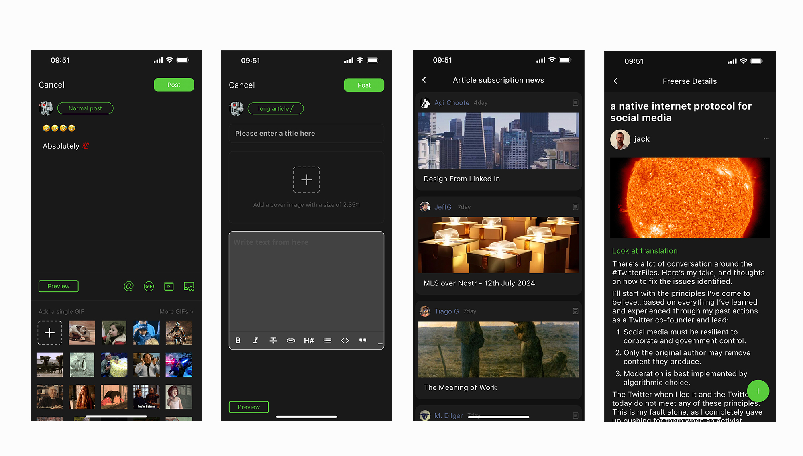

<div align="center">

<a href="https://Freerse.com">
    
</a>

</div>

# Freerse - a nostr client for  iPhone and Android

**Decentralized social applications built on Nostr.** : https://github.com/nostr-protocol/nostr

**Freerse is a simple and easy to use Nostr app.  Value Rewards Creativity.** https://freerse.com 

**Everything you need to know about using freerse.** https://freerse.com/help-center


## Freerse Download links:
-  [iOS](https://apps.apple.com/au/app/freerse/id6450604093)
-  [Android](https://play.google.com/store/apps/details?id=com.apps.freerse)
-  [Testflight](https://testflight.apple.com/join/IbJTYBAa)
-  [APK](https://github.com/Freerse/Freerse/releases/tag/v1.5.11)


## Dependencies

- Xcode 15.x
- iOS SDK 16.x

## Setup Android environment

Make sure to have the following pre-requisites installed:
1. Java 17+
2. Android Studio
3. Android 8.0+ Phone or Emulation setup

Fork and clone this repository and import it into Android Studio
```bash
git clone https://github.com/Freerse/Freerse.git
```

Use an Android Studio build action to install and run the app on your device or a simulator.

## Setup Ios environment

1. Clone this repository
2. Set up flutter devlopment 
3. Enter API keys in Config.xcconfig. 
4. Open Freerse.xcodeproj in Xcode
5. Wait for Package Dependencies to finish downloading
6. Run

# screenshot





## Questions / Contact / Feedback

freerse8@gmail.com
